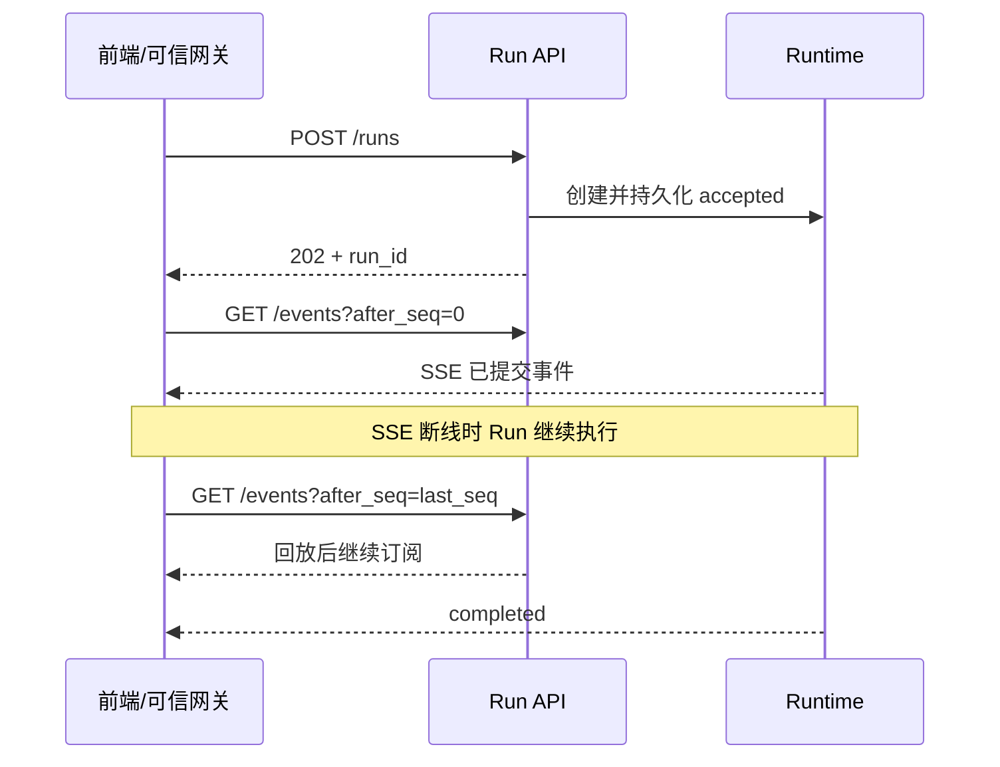

# 前端通信接口 v0.1：第一阶段实现

本接口依据前后端通信草案新增。请求创建与结果订阅分开，运行、发布器和订阅分别管理。
适用于 Dify 代为提交请求，以及前端经可信接入网关提交请求的两种链路。

## 接入身份

所有接口使用现有服务 Bearer 认证，并由可信网关注入以下 Header：

| Header | 要求 |
| --- | --- |
| `Authorization: Bearer <service-token>` | 与现有服务认证配置一致；生产环境必填。 |
| `X-End-User-ID` | 必填，稳定用户标识，最长 160 字符。 |
| `X-Tenant-ID` | 可选，默认服务的 `DEFAULT_TENANT_ID`。 |
| `X-User-Role` | 可选，默认 `patient`，允许 `patient / clinician / operator`。 |

这些字段是认证后的可信声明。网关负责验证登录身份及患者访问权限，覆盖浏览器自行提供的身份 Header，
服务 Token 保存在网关或 Dify 服务端。前端订阅经过该网关或使用可携带认证 Header 的 SSE 客户端。
本次没有接入新的用户 JWT 发行服务，也未修改已有 Dify 应用或部署配置。

`context.patient_id` 固定指 **project.dbuser.Id**，不是 robotdb 编号。
默认 Agent 按需映射 IReGo 身份；legacy 模式创建患者 Run 前沿用唯一身份映射。
三层患者信息与 IReTour 使用 project 身份。tenant/user/role/patient 决定数据作用域，conversation 在该范围内隔离。
同一用户切换患者时，即使复用 conversation_id，也不会读取另一患者的会话锚点和历史。
Run 访问按 tenant/user/role 验证所有者，再使用记录中固定的患者作用域；不接受客户端指定新的访问 scope。
跨所有者访问与过期/不存在均返回 404，避免泄露标识是否存在。

## 创建运行

`POST /v1/agent/runs`

```json
{
  "request_id": "frontend-operation-001",
  "conversation_id": null,
  "query": "解释一下这次训练",
  "context": {
    "patient_id": "3799",
    "space_id": "rehab_hall",
    "scene_version": 23,
    "selected_session_ref": null,
    "current_view": "training_detail"
  }
}
```

request_id/query 必填且去掉首尾空白；conversation_id 首轮可省略或 null，服务端生成稳定值。
context 可省略；patient_id 为正整数字符串，scene_version 为非负整数，其余上下文字段可省略或 null。
selected_session_ref 要求同时提供 patient_id。未定义字段（含 URL、SQL、角色及模型参数）返回 422。
query 长度同时受 `MAX_QUERY_LENGTH` 限制。

返回 HTTP 202：

```json
{
  "request_id": "frontend-operation-001",
  "run_id": "run_...",
  "conversation_id": "conversation_...",
  "status": "accepted",
  "events_url": "/v1/agent/runs/run_.../events",
  "snapshot_url": "/v1/agent/runs/run_..."
}
```

创建响应仅确认接收。重复提交在同一 tenant/user/role 内复用原 Run，不重复执行；query、conversation 或 context
变化（包括切换患者、空间、场景版本、选择记录、当前界面）返回 409。幂等检查先于身份映射。
并发相同 request_id 由同一请求锁串行处理。新 Run 超出 `MAX_CONCURRENT_REQUESTS` 容量时返回 429，
原 request_id 的重复查询仍可成功；结束或显式取消会释放容量。

## 订阅与回放

`GET /v1/agent/runs/{run_id}/events?after_seq=4`

省略 after_seq 时读取 `Last-Event-ID`；二者都省略时从 0 开始。显式 after_seq 优先。
负数、非整数、超出当前最后序号的游标返回 422。历史事件原样回放后继续等待新事件。
每个订阅拥有独立游标，允许多个订阅同时读取。空闲时发送 SSE 注释心跳，不占用 seq。

```text
id: 5
event: answer_part
data: {"event_id":"event_...","request_id":"frontend-operation-001","run_id":"run_...","conversation_id":"conversation_...","seq":5,"task_id":null,"goal_id":"agent","type":"answer_part","payload":{"text":"这次训练已完成。","fact_ids":[],"doc_refs":[],"revision":1,"replaces":null},"created_at":"2026-10-10T08:00:00+00:00"}

```

| 事件 | payload |
| --- | --- |
| `accepted` | text |
| `progress` | stage、text |
| `answer_part` | text、fact_ids、doc_refs、revision、replaces |
| `action_ready` | action_id、command_code、profile、delivery_status、source_space_id、scene_version、command_order |
| `artifact_ready` | artifact_ref、url、expires_at、evidence_id |
| `clarification` | text、missing_slots |
| `task_failed` | code、text、retryable |
| `completed` | outcome、goal_statuses、task_statuses、event_range |

accepted 在开头，completed 唯一且最后，其 event_range 包含自身。其余业务事件按实际完成顺序发布。
progress 使用 planning/resolving_context/querying/generating_artifact/composing；没有虚构进度百分比。
内部任务可保留额外状态供日志使用，前端整体 outcome 限定为
succeeded/partial/clarification/unavailable/failed/cancelled/unsupported。

前端只播放 answer_part 和 clarification；不扫描文本寻找指令。新 Agent 回答若含 URL、旧标签、场景指令、代码块
或完整工具 JSON，会形成安全失败事件，阻止其进入 answer_part。制品 URL 仍由真实工具结果及现有来源校验产生。
前端按 run_id + seq/event_id 去重，回答替换通过 replaces 指向旧 event_id，不依赖 goal_id；
已播放回答的回放或替换默认不重复触发 TTS。动作仅按 action_ready 执行，并持久记录 action_id 防止回放重复执行。



Run 受现有执行时限约束，默认 60 秒。订阅关闭不会调用运行取消或清空事件，也不会重置其他订阅。
历史和 ACK 使用现有 Repository 存储；生产部署为 PostgreSQL，内存开发模式只在当前进程保留。
所有者与幂等索引默认自创建起保留 `RUN_TTL_SECONDS=1800` 秒，过期需使用新的 request_id，无法继续回放。
服务重启后，对没有 completed 的持久化 Run 补一个 cancelled 终态，保留历史，不重新执行工具或动作。
仍要求单 worker、单副本；没有实现跨进程事件通知及运行迁移。

## 快照、取消与 ACK

`GET /v1/agent/runs/{run_id}` 返回精简状态：

```json
{
  "request_id": "frontend-operation-001",
  "run_id": "run_...",
  "conversation_id": "conversation_...",
  "status": "running",
  "last_seq": 5,
  "created_at": "2026-10-10T08:00:00+00:00"
}
```

快照不返回计划、工具结果、metrics 或动作列表。重开页面应订阅历史恢复展示，动作仍按 action_id 去重。
`POST /v1/agent/runs/{run_id}/cancel` 返回 `{"accepted":true}`，取消正在执行的任务并保存 completed。
已结束的 Run 取消为幂等空操作。

`POST /v1/agent/runs/{run_id}/actions/{action_id}/ack`：

```json
{"status":"failed","reason":"scene_not_ready"}
```

status 允许 executed/failed/ignored，reason 可省略，最长 500 字符。动作必须已存在于本 Run 的已提交事件中。
首次 ACK 单独持久化；相同 status/reason 重试返回相同结果，不同结果返回 409。未知动作返回 404。
响应为 `{"accepted":true,"action_id":"action_...","status":"failed"}`。
ACK 不修改历史事件、seq、Run outcome 或传输状态，不自动重发动作；失败后需新请求重新解析当前场景。
服务端 dispatched 只表示交给传输，执行成功仅来自 ACK。前端继续检查 source_space_id/scene_version。

## UI 记录上下文

selected_session_ref 先通过当前患者的历史查询确认，成功后建立带设备来源和 Evidence 的记录锚点。
每个候选设备最多查四页、每页 50 条，并受总工具预算和超时限制；无法确认则 clarification，绝不改用最新记录。
已知 ireGo/ireTour 引用前缀只查询对应设备；其他不透明引用在有预算时查询两种历史。
该边界内更旧记录可能需要前端重新定位；后续可在工具端增加患者归属验证接口以支持任意历史深度。
current_view 仅作为数据提示，不授予权限。普通问候不查询患者档案；没有记录锚点的“上一次”先澄清。
此上下文提示通过已注册的 frontend.context Prompt 渲染并记录版本，动态内容不进入模板追踪元数据。

## 错误

```json
{"error":{"code":"idempotency_conflict","message":"同一请求编号已用于不同内容。","retryable":false}}
```

401 未认证；403 权限拒绝；404 运行/动作不存在、过期或其他所有者；409 幂等/ACK 冲突；
422 字段、身份或游标不合法；429 容量已满；503 持久化或依赖暂不可用。
响应不返回验证输入、traceback、数据库连接串或后端原始响应。
SSE 响应头已发出后若持久化失败，则中止流；客户端使用最后确认的 seq 重连，未提交事件不会交付。

## 兼容与本阶段边界

原 `/v1/chat`、`/v1/runs/{id}/status`、`/v1/runs/{id}/cancel` 保留原契约：
旧 SSE id 仍为 event_id，旧连接断开仍取消；旧重复请求与快照不回放动作。
两个 `/compat/dify/...` 占位入口仍返回 501。Dify 可改为调用新创建接口获取 Run 标识，前端再订阅事件。

本阶段落实通信接口及支撑其运行的生命周期、记录上下文和失败事件。
草案的“仅报告不强制分析”“解释与报告并行且提前回答”仍需要后续调整领域工作流和 Agent 输出调度；
当前 Agent 自然语言最终回答仍在模型工具循环结束后发布。场景动作事件可在工具执行过程中立即发布。
跨场景跳转后继续执行多个动作仍需要新版场景上下文；保留已有旧场景版本阻断规则。
同一有效场景内的多动作现有顺序保留，Agent 单次工具返回的每项动作已获得独立 action_id。
前端实际 SSE 接入、TTS/动作去重和 ACK 上报，以及生产网关患者授权联调，需在相应前端/网关项目完成。

OpenAPI 由 `/openapi.json` 提供，请求、创建响应、快照、ACK、错误均有结构定义。
测试见 `tests/test_agent_api.py` 和 `tests/test_frontend_context.py`，使用合成数据与可控模型。
