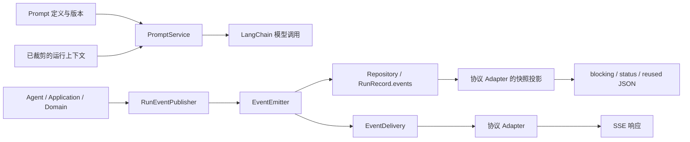

# Prompt 与出站报文统一管理方案

日期：2026-10-09。状态：已落实当前 Agent、legacy 执行链及原生 HTTP 输出。

实现入口为 `prompts/service.py`、`events/publisher.py`、`events/stream.py`、
`events/delivery.py` 和 `events/native.py`。下文保留设计依据与职责说明，接口草案的具体签名以源码为准。
历史 `LLMTaskPlanner` 和旧 Dify factory/tag helper 继续作为历史代码保留，Dify 兼容入口仍返回 501。

2026-10-10 增加 [前端 Run API v0.1](agent-run-api-v0.1.md)：`events/agent.py` 提供 seq 编码和独立订阅，
新增创建/回放/快照/取消/ACK 接口。下文“断线取消、无回放/ACK”的边界仅适用于旧 `/v1/chat`。

版本维护：新增 `*.v2.md` 等模板，在 `catalog.MANIFEST` 注册 `(prompt_id, version)` 及各片段版本，
再在 `catalog.BUNDLES` 注册新的版本组合，配置 `META_AGENT__PROMPT_BUNDLE` 并发布应用。
不同版本可复用未变化的片段；绑定对象保存已加载内容，运行期间无需文件读取或全局版本切换。

已加入模型输入迁移等价、版本共存、缺少资源、并发修订与去重、200 条无消费者事件、
保存失败/取消、断线终态，以及 HTTP 重复请求和动作快照的测试。模板资源通过 wheel 独立导入验证。

建议增加两个明确的调用入口：**`PromptService` 管理模型输入，`RunEventPublisher` 管理对外事件**。继续使用现有 `OutboundEvent`、`EventEmitter` 和 LangChain Agent；由容器统一装配模板、发布器和协议适配器。

“统一”指统一各自的规则与调用入口。Prompt 和报文具有不同的生命周期，分别管理更容易审查和扩展。

## 1. 当前代码中的实际缺口

| 部分 | 代码位置 | 当前情况与影响 |
| --- | --- | --- |
| Agent Prompt | [agent/context.py](../src/meta_agent/agent/context.py)、[agent/runtime.py](../src/meta_agent/agent/runtime.py) | 基础提示、当前时间、患者档案和预算耗尽提示分别定义与拼接；修改规则需要进入运行时代码，没有统一版本信息。 |
| legacy 意图解析 | [planning/parser.py](../src/meta_agent/planning/parser.py) | 系统提示与结构修复提示内嵌；结构化输出、历史裁剪和 Prompt 组织混在调用代码中。 |
| legacy 事实选择 | [application/composer.py](../src/meta_agent/application/composer.py) | 模型指令内嵌，同时承担事实展示、事件发布和回答修订。 |
| 历史 Planner | [prompts/planner.py](../src/meta_agent/prompts/planner.py)、[orchestration/llm_planner.py](../src/meta_agent/orchestration/llm_planner.py) | 已有独立模板和版本，但当前容器没有装配这条历史执行链，不能把它当作当前统一入口。 |
| 事件契约与持久化 | [contracts.py](../src/meta_agent/contracts.py)、[events/stream.py](../src/meta_agent/events/stream.py) | 已有事件信封、payload 校验、序号、持久化和原生 SSE 编码，是可复用的基础。 |
| 业务发布 | Agent runtime/tools、ApplicationService、ResponseComposer、SceneAdapter | 各处通过 `emit(type, dict)` 手工拼 payload；回答修订只由 Composer 管理，制品去重在 Agent tools 与 Composer 重复实现。 |
| HTTP 输出 | [api/routes.py](../src/meta_agent/api/routes.py) | 路由同时负责快照投影、SSE 消费、交付标记和断线清理；首次 blocking 又覆盖一次快照中的 events。 |
| 兼容协议 | [events/dify.py](../src/meta_agent/events/dify.py)、[adapters/dify.py](../src/meta_agent/adapters/dify.py)、[adapters/legacy_protocol.py](../src/meta_agent/adapters/legacy_protocol.py) | Dify adapter 是占位实现，旧 factory/tag helper 未接入当前链；新增协议时容易再形成一套独立拼装逻辑。 |

两个需要随设计处理的具体问题：

- `EventEmitter.emit()` 在持锁期间等待容量为 128 的队列。blocking 和直接 `application.execute()` 没有队列消费者；累计事件超过容量时，按代码存在阻塞风险，`finish()` 的结束哨兵也占队列容量。这里是静态分析，尚未复现。
- `snapshot()` 会返回整个 `record.metrics`，而患者档案目前也写入 metrics。Prompt 追踪应只增加模板元数据；患者上下文适合放在 `RunContext`，避免随通用诊断输出继续扩散。

## 2. 职责和依赖方向



| 组件 | 职责 | 状态与生命周期 |
| --- | --- | --- |
| `PromptService` | 按 ID/版本获取定义，校验变量，选择片段，渲染模型消息，返回来源元数据。 | 容器级；目录加载后只读。 |
| `RunEventPublisher` | 提供语义化、类型化发布接口；集中回答 revision/replaces、回答去重、制品去重与完成事件入口。 | 每个 run 一份，禁止跨患者或会话共享。 |
| `EventEmitter` | 创建事件信封，串行分配 seq，先持久化，再通知消费者；记录交付状态。 | 每个 run 一份，沿用现有实现并调整通知机制。 |
| `EventDelivery` | 按序消费已持久化事件，调用 adapter，处理传输结束和断线；通过 ApplicationService 取消运行。 | 每条原始 SSE 响应一份。 |
| 协议 Adapter | 将内部事件映射为协议帧，将运行记录投影成 JSON；声明协议支持情况。 | 无业务状态，可容器级复用。 |

`handler` 可作为具体消息类型的映射函数，但当前八种事件用显式方法即可。`helper` 适合 JSON 序列化、转义等纯函数。无需先建立通用插件框架或抽象基类树。

PromptService 不执行模型、查询数据或修改工具权限；Publisher 不生成回答、匹配场景命令或校验患者身份。既有业务校验完成后，再调用管理入口。

## 3. Prompt：注册、渲染和版本追踪

### 3.1 统一目录

初始目录直接用 Python manifest 和随包发布的 UTF-8 Markdown，复用现有依赖：

```text
prompts/
  __init__.py
  contracts.py          # PromptDefinition / PromptBinding / RenderedPrompt / 类型化输入
  catalog.py            # (prompt_id, version) -> 不可变定义；bundle -> 版本绑定
  service.py            # 校验、片段组合、渲染
  templates/
    agent_system.v1.md
    intent_system.v1.md
    intent_repair.v1.md
    fact_select_system.v1.md
    budget_exhausted.v1.md
  planner.py            # 历史模板保留，最后处理其兼容入口
```

| Prompt ID | 使用者 | 输入与输出约束 |
| --- | --- | --- |
| `rehab.agent` | `PatientContextMiddleware` | 输入时间、已裁剪档案、预算状态；生成 system message，历史与当前用户消息由调用方传入模型。 |
| `intent.parse` | `StructuredIntentPlanner` | 输入 query、最近对话、记录锚点、patient_brief；输出对应 `IntentDecision` 的模型消息。 |
| `intent.repair` | Planner 的结构修复重试 | 固定修复指令；是否重试仍由 Planner 与 LLMBudget 决定。 |
| `answer.fact_select` | `ResponseComposer` 的可选模型选择 | 输入 query、候选 facts；输出对应 `FactSelection` 的模型消息。 |

默认 `agent` 模式只使用 `rehab.agent`。legacy 模式按配置使用另外三个；历史 `LLMTaskPlanner` 单独标识，避免与当前 `StructuredIntentPlanner` 混淆。

### 3.2 最小契约

以下是接口草案，并非已经存在的类：

```python
@dataclass(frozen=True)
class PromptDefinition:
    prompt_id: str
    version: str
    template_hash: str
    input_model: type[BaseModel]
    output_schema: type[BaseModel] | None

@dataclass(frozen=True)
class RenderedPrompt:
    system_message: SystemMessage
    additional_messages: tuple[BaseMessage, ...]
    usage: PromptUsage  # ID、版本、模板 hash、实际采用的片段版本

class PromptService:
    def bind(self, bundle: str) -> PromptBinding: ...

    def render(
        self,
        binding: PromptBinding,
        prompt_id: str,
        variables: BaseModel,
    ) -> RenderedPrompt: ...
```

`AgentPromptInputs`、`IntentPromptInputs`、`FactSelectionPromptInputs` 分别校验输入。调用方不传入任意模板路径或可执行表达式。`output_schema` 表示该模板匹配的输出契约；`with_structured_output()` 继续由现有模型调用方负责。

渲染规则：

1. 静态文本和动态数据分开。JSON 数据只序列化一次，不把患者记录、用户文本再次当作格式模板解释。
2. Agent 基础规则在前，时间与档案使用固定数据区块，预算结束指令由受控片段追加。第一阶段保持现有消息角色与顺序，调整数据消息角色另行评估。
3. 历史裁剪、Evidence 时效检查、工具过滤和最终 token 预算检查保留在 middleware/context。预算应对实际渲染后的完整模型输入计算，包含工具 schema。
4. 缺变量、未知 ID、未发布版本和结构不匹配均明确报错。启动时验证当前编排模式所需的模板及资源，包含 wheel/Docker 中的资源可读取性。
5. 文案抽离阶段保持原文，包括重试与预算提示；业务规则调整使用后续版本，避免把管理重构和模型行为变化混在一次验收中。

### 3.3 如何管理版本

- `Settings.prompt_bundle` 选择一组明确版本，例如 `builtin-v1`。bundle 映射使用源码 manifest，首期随应用发布。
- 创建新 run 时固定 `PromptBinding`，整个 Agent 循环、重试和可选事实选择沿用这组绑定。版本切换只影响新 run。
- `PromptUsage` 记录 prompt ID、版本、静态模板与片段 hash；记录模型调用序号。静态 hash 覆盖组成该版本的全部文本和片段。
- 运行记录只保存这些元数据，不新增完整 Prompt、患者档案或用户问题的日志副本。模板版本能帮助定位行为来源，不能独自保证模型输出可复现。
- 模板内容变化必须更新版本。bundle 及模板文件留在 Git 中；回滚时部署旧 bundle 和对应资源。

工具描述 `TOOL_SPECS` 仍由工具注册表管理，并在诊断中记录实际工具集合及其 schema/description hash。无需在 Prompt 目录复制一份工具说明。

## 4. 报文：类型化发布、协议转换与交付

### 4.1 业务代码只表达要发布什么

复用 `contracts.py` 中已有 payload 模型，提供以下方法：

```python
class RunEventPublisher:
    async def accepted(self, text: str | None = None) -> OutboundEvent: ...
    async def progress(
        self, stage: str, text: str | None = None, *, task_id=None, goal_id=None
    ) -> OutboundEvent: ...
    async def answer(
        self, payload: AnswerContent, *, goal_id: str, task_id=None
    ) -> OutboundEvent | None: ...
    async def artifact(
        self, payload: ArtifactPayload, *, task_id=None, goal_id=None
    ) -> OutboundEvent | None: ...
    async def action(
        self, payload: ActionPayload, *, task_id: str, goal_id: str
    ) -> OutboundEvent: ...
    async def clarification(self, payload: ClarificationPayload, **refs) -> OutboundEvent: ...
    async def failure(self, payload: FailurePayload, **refs) -> OutboundEvent: ...
    async def completed(self, outcome: RunOutcome) -> OutboundEvent: ...
```

`AnswerContent` 只包含 `text/fact_ids/doc_refs`。Publisher 按 goal 分配 revision、填写 replaces，内容相同则不发布；Agent 的完整最终回答也使用相同入口。现有 `answer_part` 表示回答或其修订，当前 Agent 并未输出 token delta，首期沿用这一含义。

制品按现有 `artifact_ref` 去重。动作继续由 `SceneAdapter` 验证来源、空间版本和用户原话，并沿用稳定 action_id；Publisher 不按 command_code 合并动作，保留用户明确要求的重复动作与顺序。

同一 run 内，回答/制品的去重检查、事件提交和发布状态更新使用同一发布锁；状态在提交成功后更新，避免并发工具重复发布或分配相同 revision。动作只按 action_id 防重，completed 重复调用返回已有终态事件。

默认进度与接收文案可以放在一个小的 `events/messages.py` 映射中，错误的领域解释仍由业务提供。面向模型的指令与面向用户的进度文本分别维护。

`RunContext` 上的 `answer_fingerprints/answer_events/artifact_refs` 逐步迁入 Publisher，迁移期间通过同一状态对象兼容，避免同时存在两套计数。记忆保存从 Publisher 读取回答或读取已发布的事件，继续保留原有会话语义。

### 4.2 事件记录与传输分开

建议用已有 `RunRecord.events` 作为每个 run 的事件记录，SSE 使用 **seq 游标 + 变更通知** 消费，替代必须被消费的事件副本队列：

1. Emitter 在同一个序列锁内构造事件、更新运行记录并调用 Repository；保存成功后才推进可消费的 `committed_seq` 并通知消费者。
2. `EventDelivery` 从 seq=1 开始读取这个原始 run 已提交的事件，逐个交给 adapter；读完当前事件后等待 condition，再按游标继续。
3. 检查游标和进入 condition 等待必须同步，避免丢通知。消费者只读取已提交部分，不能看到正在保存的事件。
4. blocking 与直接 `application.execute()` 只记录事件，没有消费者也能完成。SSE 建立前产生的 accepted 同样能按游标读到。
5. 运行结束用独立、幂等的结束信号唤醒消费者；不占事件容量。正常情况先提交 completed，再标记结束；持久化失败也要唤醒等待者并停止交付，不能无限等候。

这仍使用现有 Repository 保存整个 RunRecord，没有引入消息中间件或独立事件表。通知是进程内机制，与当前单 worker 限制一致。未来若增加高频 token delta，再设计事件上限、批量写入和专用日志存储。

持久化失败时停止对外交付，不自动重试动作，也不能经同一故障存储递归发送失败事件。内存中未提交的事件应回退或隔离；重启继续使用现有保守中断快照。

### 4.3 Adapter 统一原生 SSE 和快照投影

把现有 `NativeEventAdapter` 的编码能力迁入或包装成 `NativeOutputAdapter`：

```python
class NativeOutputAdapter:
    def encode_event(self, event: OutboundEvent) -> tuple[str, ...]: ...

    def snapshot(
        self, record: RunRecord, *, purpose: SnapshotPurpose
    ) -> dict[str, Any]: ...
```

每个内部事件可映射为零到多帧，便于未来协议过滤 progress 或拆分终态。原生协议每事件输出一帧；协议是否支持 action_ready 要在启动或选择通道时检查，不静默丢弃动作。

| 路径 | 投影与交付规则 |
| --- | --- |
| 首次 streaming | 原生 SSE，保持 event_id/type/seq 及现有 schema_version=1.0。 |
| 首次 blocking | 保持当前终态 JSON，包括首次动作事件；动作交付状态仍为 delivery_unknown，不新增 dispatched 标记。 |
| 重复请求 | 保持 JSON 快照；运行中 HTTP 202，已结束 HTTP 200；排除 action_ready，不建立第二条 SSE，也不重新执行业务。 |
| status / cancel | 按授权作用域返回快照，排除 action_ready。 |

投影目的用枚举表达，替代路由中先过滤再覆盖 events 的隐式差异。业务去重指纹继续只描述业务请求；协议和 blocking/streaming 的选择不使相同 request_id 重新执行。

路由保留认证、输入校验、HTTP 状态和响应对象构造；快照规则交给 adapter，SSE 消费及清理交给 EventDelivery。ApplicationService 继续拥有运行取消和终态结算。

Dify 与旧标签协议保留为未来 adapter。Dify 当前通过原生 blocking API 展示，本次设计不需要启用兼容端点；旧 factory/helper 可在真正迁移时作为 adapter 内部工具使用，避免成为另一条发布入口。

### 4.4 断线和动作的语义保持明确

- 成功发布只表示事件已登记并持久化。`dispatched` 继续只表示交给响应传输，不证明客户端收到或 Unity 执行成功。
- EventDelivery 在流生成器继续执行后标记该事件已交给传输，保留当前保守判断；多帧映射需全部交给传输后才标记。
- 断线先使传输脱离，禁止继续输出，再取消应用运行及子工具，最终保留 delivery_unknown 和运行终态。
- **传输脱离与发布器关闭分别建模**：断线后仍允许应用持久化取消和 completed，避免关闭 emitter 导致终态无法记录。
- completed 最多发布一次，event_range 由 Emitter 根据实际 seq 填写并包含 completed 自身；不同协议只能转换它，不能另造业务终态。
- 不通过自动重连、状态查询或重复请求重放动作。需要端到端确认时，另行增加客户端 ACK 契约。

## 5. 装配与调用效果

在 [infrastructure/container.py](../src/meta_agent/infrastructure/container.py) 创建 PromptService 与无状态 adapter；注入 Agent、legacy Planner 和 Composer。ApplicationService 创建新 run 时固定 PromptBinding，并创建一份 Emitter/Publisher。

`RunContext` 增加 `prompts/prompt_binding/events/patient_profile_context`；业务逐步改用 `ctx.events`。底层 emitter 由应用与交付组件持有。迁移期可以保留旧字段，但所有路径必须共用同一发布状态。

调用效果示意：

```python
# Middleware：继续负责数据准备、工具过滤与预算。
rendered = ctx.prompts.render(
    ctx.prompt_binding,
    "rehab.agent",
    AgentPromptInputs(
        now=utcnow(),
        patient_profile=ctx.patient_profile_context,
        budget_exhausted=budget_exhausted,
    ),
)
response = await handler(request.override(
    system_prompt=rendered.system_message,
    messages=bounded_messages,
    tools=available_tools,
))

# Runtime：只提供回答内容；revision/replaces 由 Publisher 管理。
await ctx.events.answer(AnswerContent(text=answer), goal_id="agent")

# 工具：已完成 URL、有效期和来源校验后发布制品。
await ctx.events.artifact(ArtifactPayload.model_validate(artifact), task_id=tid)
```

## 6. 分阶段实施与验收

| 阶段 | 变更范围 | 验收重点 |
| --- | --- | --- |
| A：Prompt 管理 | 新增 catalog/service/templates；接入 Agent、当前 legacy Planner 与事实选择；注入版本绑定。 | 固定时间和上下文时，抽离前后模型可见消息一致；JSON 大括号不被二次展开；缺变量/资源/版本明确失败；预算结束仍能形成回答。 |
| B：发布入口 | 增加 Publisher，迁移各处 emit 调用与回答/制品状态。 | payload 符合原契约；同 goal 修订及去重正确；同制品仅一次；重复动作次数和顺序保留；Agent 工具错误仍可返回模型并重试。 |
| C：交付与投影 | 游标通知替代强制队列；增加 EventDelivery 与 NativeOutputAdapter；精简路由。 | 无消费者发布超过 128 个事件仍可结束；并发 seq 有序；首次 blocking、重复请求和 status 差异保留；断线取消工具并记录终态；保存失败不会输出未提交事件或挂住。 |
| D：收口 | 清理兼容入口和旧字段，补充运行元数据文档；历史代码是否迁移单独确认其使用范围。 | 当前 Agent 与 legacy 模式均回归；旧持久化记录仍可读取；Dify 兼容端点保持既定状态。 |

每阶段先做行为等价迁移。患者档案从 metrics 移出会改变现有诊断字段，应在阶段 A 明确记录这一接口差异，并检查展示端是否读取该字段。

复用 `test_single_agent.py`、`test_native_api.py`、`test_native_runtime.py`、`test_runtime_reliability.py` 的已有行为测试；补充模板绑定、并发发布、无消费者、通知竞争、持久化失败和断线终态的针对性测试。结构化模型消息的比较优先覆盖固定输入的角色、顺序与文本，不依赖真实模型生成相同自然语言。

完成标准是：修改提示规则有明确位置和版本；发布新回答或制品无需拼信封或维护修订状态；接入新协议只实现转换与投影；业务权限、Evidence 和动作语义仍有明确归属。
